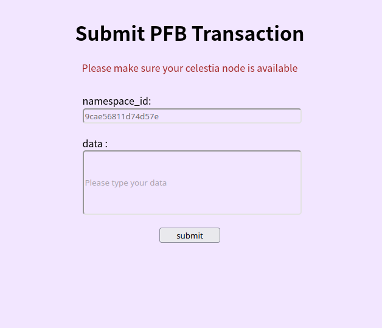
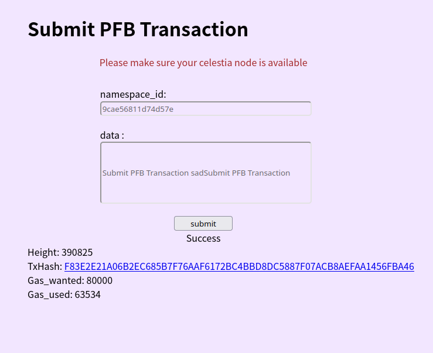

# submit_celestia_pfb

UI for submit celestia pfb.




## at first, make sure to run a [celestia light node](https://docs.celestia.org/nodes/light-node/) with port 26659.

## install nvm

`curl -o- https://raw.githubusercontent.com/nvm-sh/nvm/v0.39.3/install.sh | bash`

## install npm 

`nvm install --lts`

## install packages

```
npm install child_process
npm install express
```

## how to run

```
cd submit_celestia_pfb
node main.js
```

visit [localhost:4020](localhost:4020) in browser.
